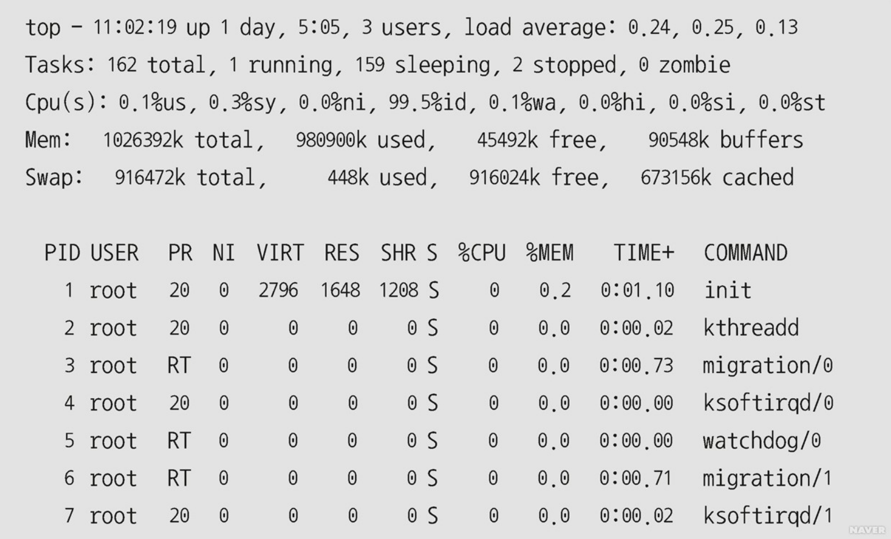
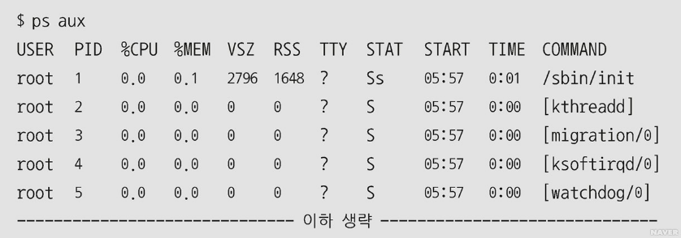

# [Linux] top, ps, jobs, kill 명령어
|  |top|ps|jobs|kill|
|----|----|----|----|----|
|OS|Linux에서만 지원|Unix, Linux 모두 지원|Unix, Linux 모두 지원|Unix, Linux 모두 지원|
|경로|/usr/bin/top|/bin/ps|내부 명령어|/bin/kill
|키워드|프로세스 상황|프로세스 상황|현재 세션 작업 상태|프로세스 종료|  

## top
### 설명 및 예제
- Linux에서 현재 실행되고 있는 프로세스에 관한 시스템 프로세스/메모리 사용 현황을 5초 간격으로 **실시간** 출력하는 명령어  
- 출력 기본값은 현재시간, 시스템 업데이트 시간, 시스템에 로그인한 사용자 수, 지난 1분, 지난 5분, 지난 15분 시스템 평균 부하  
- Microsoft Windows의 작업 관리자와 같은 개념  
  
> ### top [옵션]

   
|옵션|설명|
|-----|-----|
|-b|배치모드로 정보 출력|
|-d delay|지정한 시간의 간격으로 정보 출력|
|-n num|지정한 시간만큼 정보 출력|
|-p pid|지정한 프로세스 ID(pid)의 정보만 출력|
|-q|시간의 간격 없이 정보 출력|
|-s|시큐어 모드|
|-S|누적된 정보 출력|  

  
### top 단축키 명령어
|명령어|설명|
|-----|-----|
|space|정보 업데이트|
|^L|스크린 초기화|
|F(f)|필드 추가 및 제거|
|O(o)|출력하는 필드의 정렬 순서 변경|
|h(?)|사용 가능한 명령어 출력
|k|프로세스 종료|
|n(#)|출력할 프로세스의 개수 지정|
|s|출력할 정보의 업데이트 시간 지정|
|q|top 종료|

### top 실행 예제

###### [출처: 네이버 지식백과](https://terms.naver.com/entry.naver?docId=4125861&cid=59321&categoryId=59321)
-----------------------

## ps
### 설명 및 예제
- 현재 실행 중인 프로세스의 상황 출력
- 출력 기본값은 CPU 사용도가 **낮은 순서**대로 출력
  
> ### ps [옵션]

   
|옵션|설명|
|-----|-----|
|-A|모든 프로세스 출력|
|-a|세션 리더 및 터미널에 속하지 않는 프로세스 제외 출력|
|-N|ps 프로세스를 제외한 모든 프로세스 출력|
|-U|사용자 ID에 관련된 정보를 출력|
|-u|사용자 ID 지정|
|-C|지정한 명령어의 이름에 관련된 정보 출력|
|c|시스템 내부에 보관 중인 명령어 이름 출력|
|--help|사용법 출력|  
###### 옵션에 대쉬(-)가 없는 경우는 BSD 계열의 옵션이고 Unix98의 옵션은 하나의 대쉬로 출력하며 GNU는 대쉬가 두 개인 경우도 있지만 호환이 가능하다.

  
### ps 필드명
|필드명|설명|옵션|
|-----|-----|-----|
|CMD|사용자가 실행한 명령 이름|-f, -l, l|
|COMMAND|사용자가 실행한 명령 이름|s, u, v|
|F|프로세스 및 스레드에 관련된 항목|-l, l|
|TTY|연결되어 있는 터미널(기본 필드)|
|PID|프로세스 ID(기본 필드)|
|UID|사용자 ID|-f, -l, l|
|USER|사용자 이름|u|
|STIME|프로세스의 시작 시간|-f, u|
|VSZ|가상 메모리에 적재된 프로세스의 KB 단위 크기|
|%CPU|마지막 1분 동안 프로세스가 사용한 CPU 점유율|u|
|%MEM|마지막 1분 동안 프로세스가 사용한 메모리 점유율|u, v|
|SAT|실행되고 있는 프로세스의 상태|s, u, v|

### ps aux(시스템의 모든 프로세스 확인) 실행 예제

###### [출처: 네이버 지식백과](https://terms.naver.com/entry.naver?docId=4125773&cid=59321&categoryId=59321#TABLE_OF_CONTENT3)
